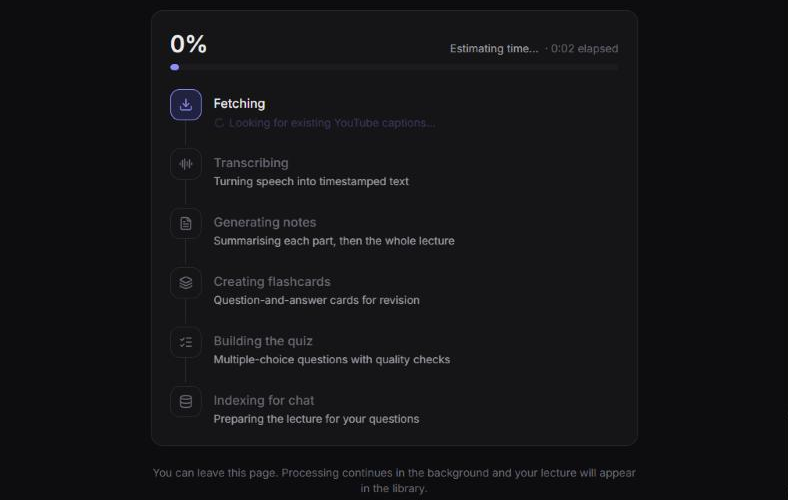
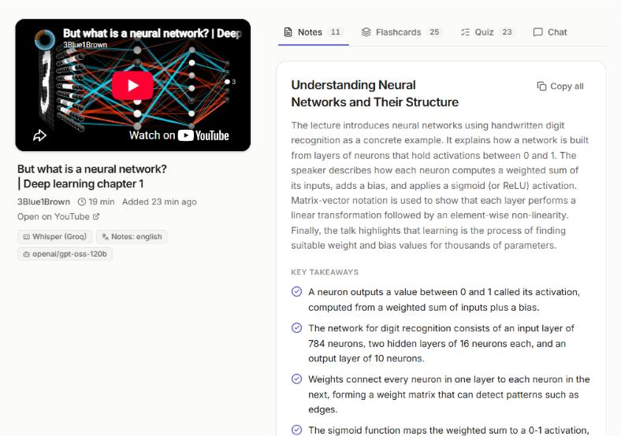
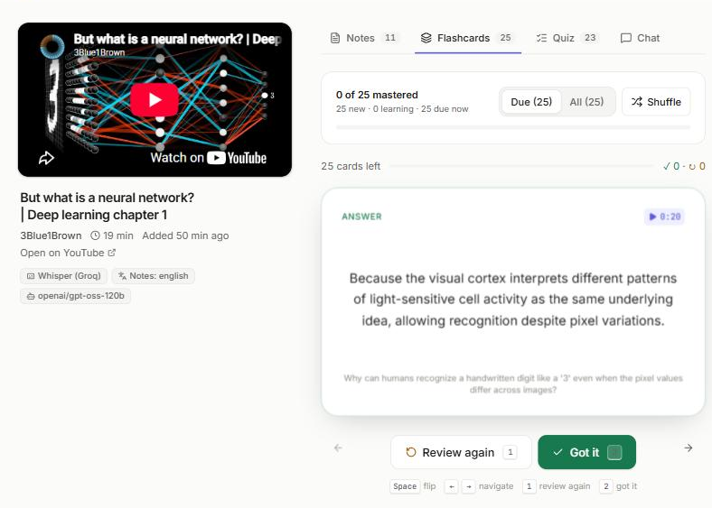
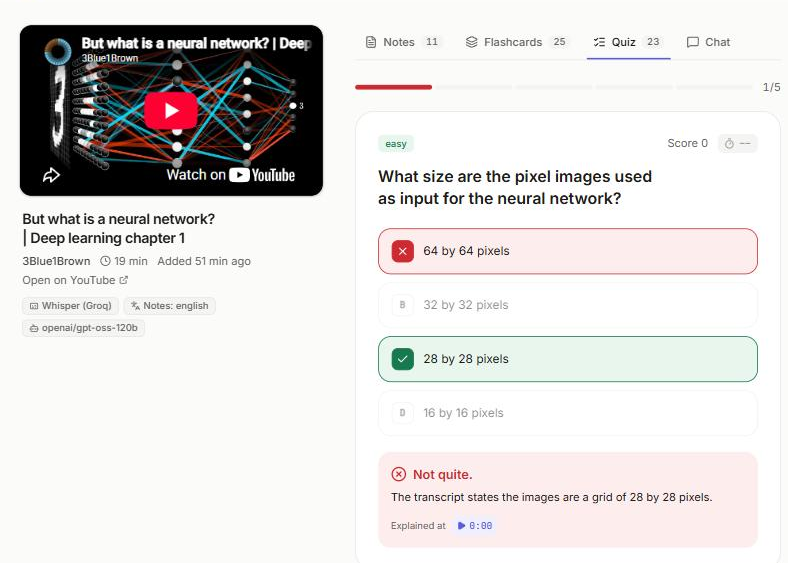
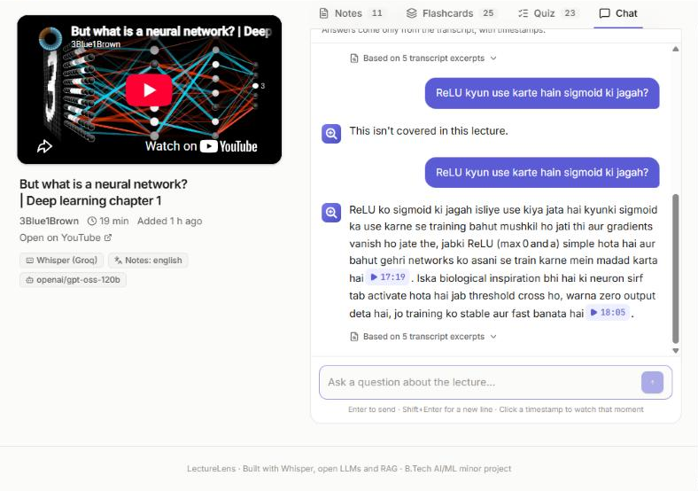
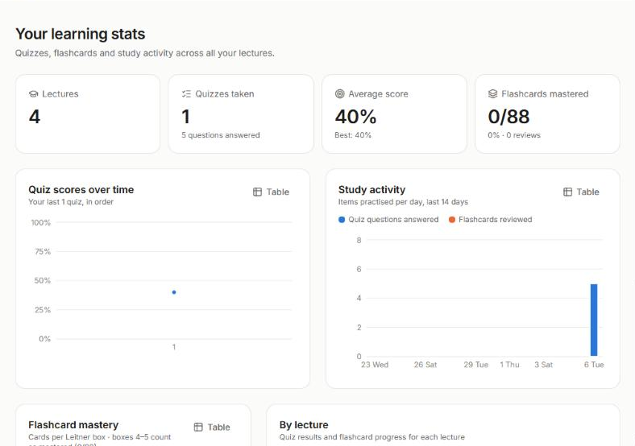
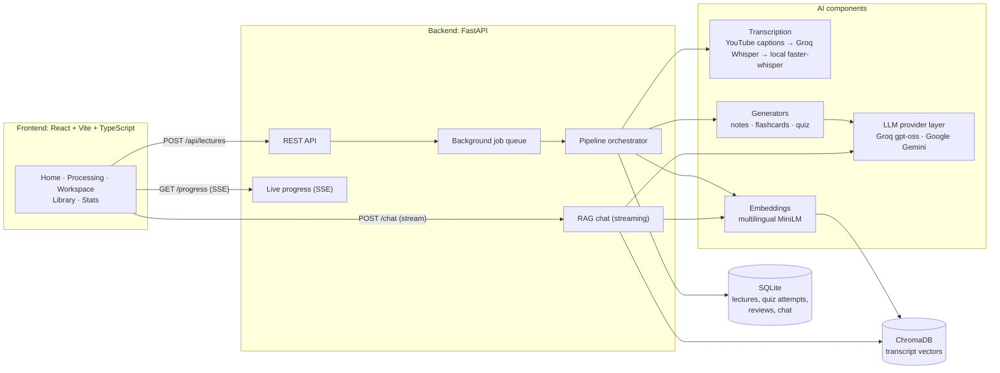
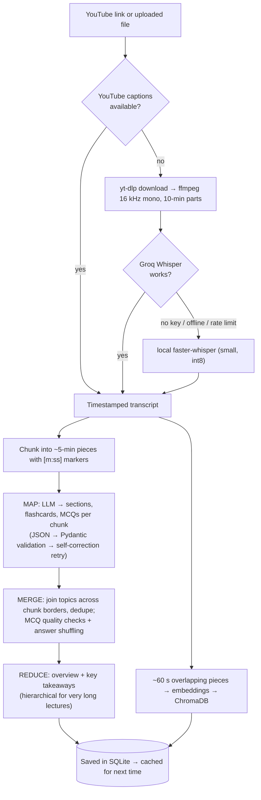
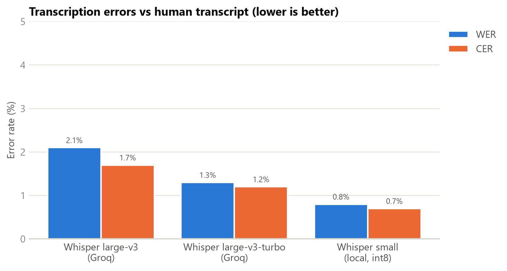
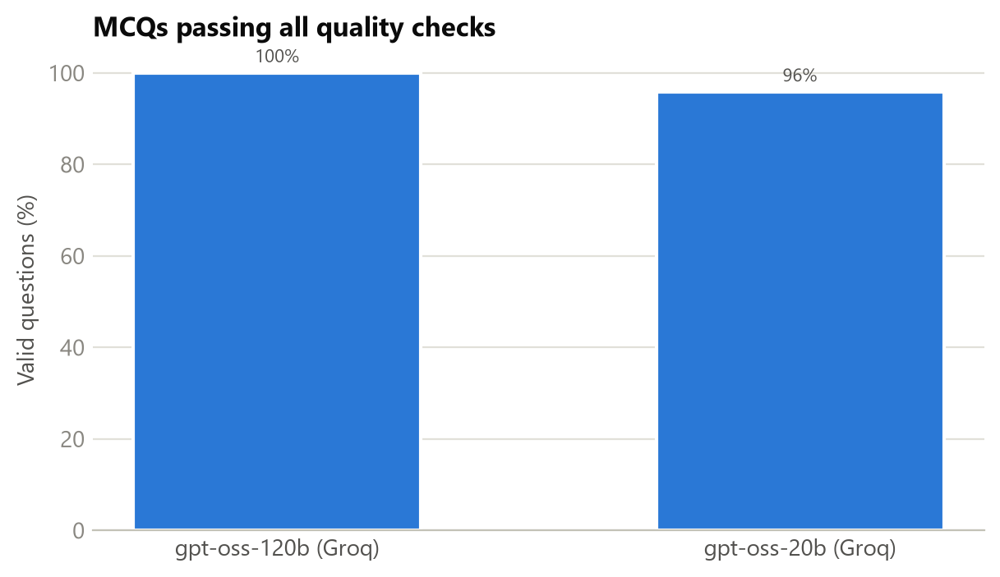

# Lectura

**Turn any lecture into smart notes, flashcards, quizzes and a chat you can ask questions.**

Paste a YouTube link or upload a recording (English, Hindi or Hinglish). Lectura transcribes it,
writes structured notes with clickable timestamps, builds flashcards with spaced repetition and a
quality-checked quiz, and lets you **chat with the lecture**: answers come only from the transcript,
with timestamp citations you can click to verify.

> B.Tech AI/ML minor project · Python · FastAPI · React · Whisper · open LLMs · RAG · 100% free tools

---

## Features

| | Feature | Details |
|---|---|---|
| 📝 | **Smart notes** | Sections with summaries, key points, definitions and highlighted key terms; every section has a timestamp that jumps the embedded video to that moment; copy as Markdown |
| 🃏 | **Flashcards** | 3D flip animation, keyboard shortcuts (Space / ← → / 1 / 2), **Leitner spaced repetition**: cards you miss come back sooner |
| ✅ | **MCQ quiz** | 5–20 questions, easy/medium/hard, optional timer, instant feedback with explanations, results screen, *Retry wrong answers*; every question passes automatic quality checks |
| 💬 | **Chat with the lecture (RAG)** | Streaming answers grounded only in the transcript, with clickable `[m:ss]` citations; says *"This isn't covered in this lecture"* instead of guessing |
| 📚 | **Library & stats** | Searchable library; dashboard with quiz scores over time, study activity and flashcard mastery (charts with table views) |
| ⬇️ | **Export** | Notes as **PDF** (Hindi-capable) or **Markdown**; flashcards as **Anki** CSV |
| 🌐 | **Languages** | English, Hindi and Hinglish lectures; notes in English, Hindi or Hinglish |
| ⚡ | **Fast & resilient** | Uses existing YouTube captions when possible, otherwise Whisper (cloud → local fallback); live progress via Server-Sent Events; results cached in SQLite |

## Screenshots

> Add your screenshots to `docs/screenshots/` with these file names and they will appear here.

| Home | Processing | Notes |
|---|---|---|
|  |  |  |

| Flashcards | Quiz | Chat |
|---|---|---|
|  |  |  |

| Library | Stats | Dark mode / mobile |
|---|---|---|
|  |  |  |

---

## Architecture



### Processing pipeline



## Tech stack

| Layer | Technology |
|---|---|
| Backend | Python 3.11, FastAPI, Pydantic v2, SQLModel (SQLite), pydantic-settings / python-dotenv |
| Transcription | youtube-transcript-api, yt-dlp, ffmpeg, Whisper large-v3 on **Groq**, **faster-whisper** (CTranslate2, int8) |
| LLMs | **Groq** `openai/gpt-oss-120b` (default), **Google Gemini** Flash, via a small provider abstraction |
| RAG | sentence-transformers `paraphrase-multilingual-MiniLM-L12-v2`, **ChromaDB** (HNSW, cosine) |
| Export & eval | fpdf2 + HarfBuzz (Devanagari PDF), rouge-score, jiwer, matplotlib |
| Frontend | React 19, Vite, TypeScript, Tailwind CSS v4, Framer Motion, TanStack Query, React Router, lucide-react, react-youtube, react-markdown, Recharts, sonner |
| Testing | pytest (126 backend tests + 11 evaluation tests, fake LLM, no network needed), TypeScript strict mode |

> **Why gpt-oss and not Llama?** The plan was Llama 3 70B on Groq, but Groq retired its Llama chat
> models for this account (checked October 2026). `openai/gpt-oss-120b` is an open-weight model
> (Apache 2.0) available free on Groq. Models are configured in `.env`, so switching is one line.

---

## Setup on Windows

### 1. Install the tools (once)

| Tool | How |
|---|---|
| **Python 3.11** | <https://www.python.org/downloads/> (tick *Add to PATH*), or `winget install Python.Python.3.11` |
| **Node.js 20+** | <https://nodejs.org/> (LTS), or `winget install OpenJS.NodeJS.LTS` |
| **ffmpeg** | `winget install Gyan.FFmpeg`, then **open a new terminal** and check `ffmpeg -version` |
| **Git** | <https://git-scm.com/download/win> |

### 2. Get the free API keys

**Groq (required)**
1. Go to <https://console.groq.com> and sign in with Google.
2. **API Keys → Create API Key**, give it a name (e.g. *Lectura*), **Submit**.
3. Copy the key (starts with `gsk_`). It is shown only once.

**Google Gemini (optional, for the LLM comparison)**
1. Go to <https://aistudio.google.com> and sign in.
2. **Get API key → Create API key**, copy it.

Never share keys, paste them in chats or commit them; `.env` is git-ignored.

### 3. Install and configure

```powershell
cd C:\Projects\LectureLens
powershell -ExecutionPolicy Bypass -File setup.ps1
```

`setup.ps1` creates the Python virtual environment, installs all packages (first time ~10 min:
PyTorch is large), runs `npm install`, runs the tests and creates `backend\.env`.
Then open `backend\.env` and paste your key after `GROQ_API_KEY=` (and `GEMINI_API_KEY=` if you have one).

### 4. Run

**Double-click `start.bat`.** It opens the backend and the frontend in two windows and then
<http://localhost:5173> in your browser. Keep both windows open while using Lectura; close them to stop.

<details>
<summary>Manual start (two terminals)</summary>

```powershell
# Terminal 1: backend  → http://127.0.0.1:8000/docs
cd C:\Projects\LectureLens\backend
.\.venv\Scripts\Activate.ps1
uvicorn app.main:app --reload

# Terminal 2: frontend → http://localhost:5173
cd C:\Projects\LectureLens\frontend
npm run dev
```
</details>

<details>
<summary>Command-line tools (each phase can be tested without the UI)</summary>

```powershell
cd backend; .\.venv\Scripts\Activate.ps1
python -m cli.transcribe https://www.youtube.com/watch?v=aircAruvnKk        # transcript
python -m cli.notes data\transcripts\aircAruvnKk.json                       # notes
python -m cli.study data\transcripts\aircAruvnKk.json --play                # flashcards + terminal quiz
python -m pytest                                                            # tests
```
</details>

### Configuration (`backend/.env`)

All settings have sensible defaults; see `backend/.env.example` for the full list.

| Setting | Default | Meaning |
|---|---|---|
| `GROQ_API_KEY` / `GEMINI_API_KEY` | – | API keys |
| `LLM_PROVIDER` | `groq` | `groq` or `gemini` |
| `GROQ_MODEL` | `openai/gpt-oss-120b` | e.g. `openai/gpt-oss-20b` for speed |
| `GEMINI_MODEL` | `gemini-flash-latest` | pin a version for reproducible evaluation |
| `LOCAL_WHISPER_MODEL` | `small` | offline fallback: `tiny`, `base`, `small`, `medium` |
| `CHUNK_SECONDS` | `300` | chunk length for the map step |
| `RAG_TOP_K` / `RAG_MIN_SIMILARITY` | `5` / `0.20` | excerpts per chat answer / "unrelated question" threshold |
| `CORS_ORIGINS` | localhost:5173 | websites allowed to call the API (add your Vercel URL) |

---

## How it works (key concepts)

### 1. Speech-to-text with Whisper
Whisper is an encoder–decoder **Transformer** trained on 680,000 hours of multilingual audio. Audio is
turned into a **log-Mel spectrogram** (an image of which frequencies are present over time); the encoder
reads it and the decoder writes text token by token, predicting **timestamps** too. Lectura converts
audio to 16 kHz mono (what Whisper was trained on) and splits it into 10-minute parts, keeping each part's
**offset** so timestamps stay correct. The local fallback, **faster-whisper**, runs Whisper with
CTranslate2 and **int8 quantisation** (8-bit weights: ~4× smaller and faster on CPU). **Voice Activity
Detection** skips silence, which also prevents hallucinated text.
*Graceful degradation:* captions (instant) → Groq Whisper (fast, needs a key) → local Whisper (always works).

### 2. Chunking
LLMs have limited context and miss details in very long inputs (*lost in the middle*), and free tiers limit
tokens per minute. The transcript is split into ~5-minute chunks at segment boundaries, with a `[m:ss]`
marker every ~20 s so the model can say *where* each topic starts. In code, timestamps are clamped to the
chunk's range, so an invented time can't escape.

### 3. Map-reduce summarisation
- **Map:** each chunk → 1–3 topic sections (title, timestamp, summary, key points, terms, definitions).
- **Merge:** neighbouring sections about the same topic (split by a chunk border) are joined; duplicates
  removed with fuzzy matching (number-aware: "layer 1" ≠ "layer 2").
- **Reduce:** only the short section summaries go back to the LLM to write the overview and key takeaways.
  Very long lectures are reduced in batches first (**hierarchical reduce**). Summary length scales with
  the lecture, so a 1-minute clip doesn't get 8 padded takeaways.

### 4. Reliable structured output
The LLM must return JSON in a fixed shape: provider **JSON mode** → **Pydantic validation** → if invalid,
the model's own answer and the exact error are sent back (**self-correction retry**). Prompts enforce
grounding ("use ONLY the transcript", "skip what you can't hear clearly", ignore promos and greetings).

### 5. MCQ quality checks
Code (not the LLM) checks every question: exactly 4 distinct, non-empty options; the answer text matches
**exactly one** option; no "All/None of the above"; no duplicate questions. Rejections are logged (the
**MCQ validity rate**). Options are then **shuffled with a fixed seed** to remove LLM *position bias*
(models over-use options A/B).

### 6. Spaced repetition (Leitner system)
Five boxes reviewed after 0, 1, 3, 7 and 14 days. *Got it* moves a card up a box; *Review again* sends it
to box 1, and within a session it returns 3 cards later. This uses the **spacing effect** and **active
recall**; boxes 4–5 count as mastered.

### 7. Embeddings
An embedding model maps text to a vector (384 numbers) so that texts with similar **meaning** are close,
even across languages: *"bias kya karta hai?"* finds the English explanation of bias. Closeness is
**cosine similarity** (1 = same meaning, ~0 = unrelated).

### 8. RAG: Retrieval-Augmented Generation
1. **Index:** transcript → ~60 s pieces with 15 s overlap → embeddings → **ChromaDB** (HNSW approximate
   nearest-neighbour index), tagged by lecture.
2. **Retrieve:** the question is embedded and the 5 most similar pieces are found. Retrieval uses the
   question alone *and* combined with the previous question, so follow-ups work without dragging new
   topics back to the old one.
3. **Generate:** the LLM answers **only** from those excerpts, citing `[m:ss]`; if nothing relevant is
   found (similarity < 0.20, calibrated: on-topic 0.45–0.80 vs off-topic 0.03–0.13), it answers
   *"This isn't covered in this lecture"* **without calling the LLM**. Answers stream token by token.

### 9. System design
Processing takes minutes, so `POST /api/lectures` only **queues a background job** and returns `202
Accepted`; a worker thread runs the pipeline and the browser follows progress with **Server-Sent Events**.
Results are cached by YouTube ID or **SHA-256 file hash**, so the same lecture is never processed twice.
Patterns used: app factory, repository, dependency injection, strategy/adapter (LLM providers).

---

## Evaluation

Run it yourself: `backend\.venv\Scripts\python evaluation\run_eval.py` (details in [`evaluation/README.md`](evaluation/README.md)).
Tables are saved as CSV/Markdown and charts as PNG in `evaluation/results/`.

### Transcription accuracy (WER / CER)
First 117.5 s of 3Blue1Brown's *But what is a neural network?*, compared with the creator's **human-written captions** (375 words).

| Engine | WER raw | WER (normalised) | CER | Processing time | Real-time factor |
|---|---|---|---|---|---|
| Whisper large-v3 (Groq) | 4.9% | 2.1% | 1.7% | 2.1 s | 0.018 |
| Whisper large-v3-turbo (Groq) | 4.7% | 1.3% | 1.2% | 1.2 s | 0.010 |
| Whisper small (local, int8, CPU) | 3.3% | 0.8% | 0.7% | 19.2 s | 0.163 |



**Findings.** Most raw "errors" were writing-style differences ("28x28" vs "28 by 28", "3" vs "three"), so
WER is reported before and after standard text normalisation. On clean English lecture audio all engines are
near-human (3–8 words different out of 375, mostly filler words), so the ranking is not meaningful on this
sample; the cloud engines are ~9–16× faster than local CPU inference.

### LLM comparison (notes + quiz generation, 2 lectures)

| Model | Avg API time / lecture | Avg tokens | MCQ validity |
|---|---|---|---|
| gpt-oss-120b (Groq) | 64.3 s | 16,137 | **100%** (48/48) |
| gpt-oss-20b (Groq) | 62.8 s | 14,935 | 95.8% (46/48) |
| Gemini Flash | *run with a `GEMINI_API_KEY`* | | |



**Findings.** On Groq's hardware the 20B model is barely faster, but produced invalid questions that the
120B model didn't, supporting gpt-oss-120b as the default.

### Summary quality (ROUGE)
ROUGE-1/2/L (precision, recall, F1) of the generated overview + key takeaways against **human-written
reference summaries**, compared with a *Lead-N* baseline (the first N words of the transcript).
*Results appear here after adding reference summaries in `evaluation/references/summaries/` and re-running.*

---

## API reference

Interactive docs at <http://127.0.0.1:8000/docs>.

| Method & path | Purpose |
|---|---|
| `POST /api/lectures` | Start processing a YouTube `url` or uploaded `file` (form data); returns instantly, `cached: true` if already processed |
| `GET /api/lectures?q=` | Library (search by title) |
| `GET /api/lectures/{id}` | Status, notes and flashcards of one lecture |
| `DELETE /api/lectures/{id}` | Delete a lecture and everything related |
| `GET /api/lectures/{id}/progress` | Live progress (Server-Sent Events) |
| `GET /api/lectures/{id}/transcript` | Timestamped transcript |
| `GET /api/lectures/{id}/quiz?count&difficulty&ids` | Pick quiz questions from the question bank |
| `POST /api/lectures/{id}/quiz/submit` | Score a quiz (server-side) and save the attempt |
| `GET /api/lectures/{id}/flashcards/progress` | Leitner box / due status of each card |
| `POST /api/lectures/{id}/flashcards/{card}/review` | Record *got it* / *again* |
| `GET·POST·DELETE /api/lectures/{id}/chat` | Chat history / ask (streamed SSE) / clear |
| `GET /api/lectures/{id}/export?format=pdf\|md\|csv` | Download notes (PDF/Markdown) or Anki flashcards |
| `GET /api/stats` | Dashboard statistics |
| `GET /api/health` | Server status and configured AI provider |

## Project structure

```
LectureLens/
├── start.bat · start.ps1 · setup.ps1   one-click start and setup (Windows)
├── backend/
│   ├── app/
│   │   ├── transcription/   captions, yt-dlp, ffmpeg, Groq Whisper, faster-whisper
│   │   ├── llm/             provider interface, Groq, Gemini, JSON validation + retry
│   │   ├── generators/      chunking, notes (map-reduce), flashcards, quiz, validators, prompts
│   │   ├── rag/             retrieval chunks, embeddings, ChromaDB store, chat service
│   │   ├── study/           Leitner spaced repetition, statistics
│   │   ├── export/          PDF, Anki CSV (Markdown in generators/)
│   │   ├── pipeline/        orchestrator, background jobs, live progress
│   │   ├── api/             routes, schemas, error handling
│   │   ├── db/              SQLModel tables, session, repository
│   │   └── main.py          FastAPI app factory
│   ├── cli/                 command-line test tools
│   ├── tests/               pytest suite (fake LLM, no network)
│   └── Dockerfile           for Hugging Face Spaces / Render
├── frontend/
│   └── src/  pages/ · features/ (notes, flashcards, quiz, chat, …) · components/ · hooks/ · lib/
├── evaluation/              ROUGE, LLM comparison, WER: scripts, references, results
└── docs/                    DEPLOYMENT.md, screenshots/
```

## Deployment

Backend → **Hugging Face Spaces** (Docker, free CPU with 16 GB RAM); frontend → **Vercel**.
Step-by-step guide: **[docs/DEPLOYMENT.md](docs/DEPLOYMENT.md)** (Render alternative included).

## Limitations

- **YouTube from cloud servers:** YouTube often blocks caption and audio requests from datacenter IPs, so on
  the deployed version file upload is the reliable path. Locally, links work normally.
- **Free-tier rate limits:** Groq's free tier (~8,000 tokens/minute) makes a 1-hour lecture take several
  minutes; the app waits and retries automatically.
- **Faithfulness is not guaranteed:** despite grounding rules, the chat once added correct but *outside*
  knowledge ("vanishing gradients") that the speaker never said. Citations let users verify claims.
- **Hindi in Devanagari:** retrieval works well for English and Hinglish, but is weaker for questions written
  in Devanagari with the small multilingual embedding model.
- **Evaluation scale:** a few lectures and one 2-minute clip give indicative, not statistically significant,
  results.
- **No user accounts:** one local user; the deployed demo has no login.

## Future scope

- User accounts and authentication; per-user libraries and quotas
- Stronger multilingual retrieval (e.g. `bge-m3`) or translating questions before search
- Automatic faithfulness checking (LLM-as-judge / NLI) of chat answers, and measuring it in the evaluation
- Speaker diarisation and slide/OCR extraction for richer notes
- Playlists and whole-course processing; cross-lecture chat
- A mobile app (the API is already frontend-independent)
- GPU inference for faster local transcription

## Acknowledgements

OpenAI Whisper · faster-whisper · Groq · Google Gemini · sentence-transformers · ChromaDB · FastAPI ·
React · 3Blue1Brown (sample lectures and human reference captions used for evaluation).
